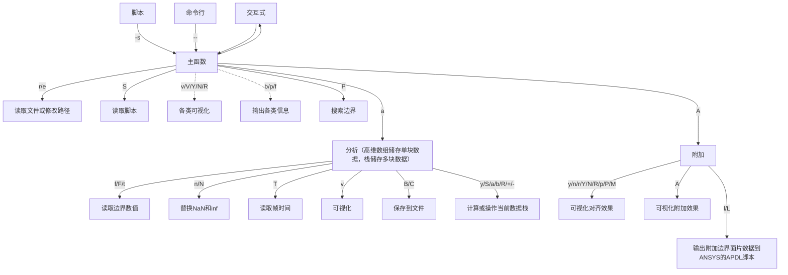

# 边界读取器

*这是本人毕业设计的一部分，由于暂时不再从事该工作，现在将本仓库存档。*

用于将 [FDS] 输出转换为 APDL 脚本的工具，可以用于结合 FDS 与 ANSYS 实现单向热力耦合模拟。

同时支持少量可视化与数据处理功能。

[FDS]: https://github.com/firemodels/fds

## 模型

```mermaid
graph TB
 交互式
 main[主函数]
 analysis["分析（高维数组储存单块数据，栈储存多块数据）"]
 脚本-- "-s" -->main
 命令行-- "--" -->main
 交互式-->main --> 交互式
 main--a--->analysis
 analysis--"f/F/t"-->读取边界数值
 analysis--"n/N"-->替换NaN和inf
 analysis--T-->读取帧时间
 analysis--v-->可视化
 analysis--B/C-->保存到文件
 analysis--"y/S/a/b/R/+/-"-->计算或操作当前数据栈
 main--"r/e"-->读取文件或修改路径
 main--S-->读取脚本
 main--A--->附加
 附加--l/L--->输出附加边界面片数据到ANSYS的APDL脚本
 附加--y/n/r/Y/N/R/p/P/M-->可视化对齐效果
 附加--A-->可视化附加效果
 main-. "v/V/Y/N/R" .->各类可视化
 main-. "b/p/f" .->输出各类信息
 main--P-->搜索边界
```
